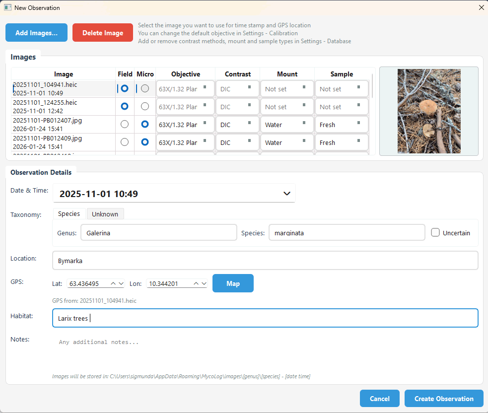
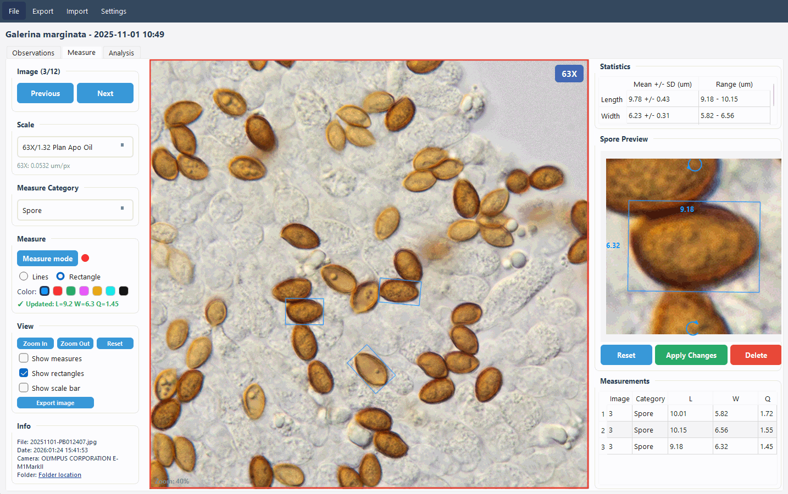
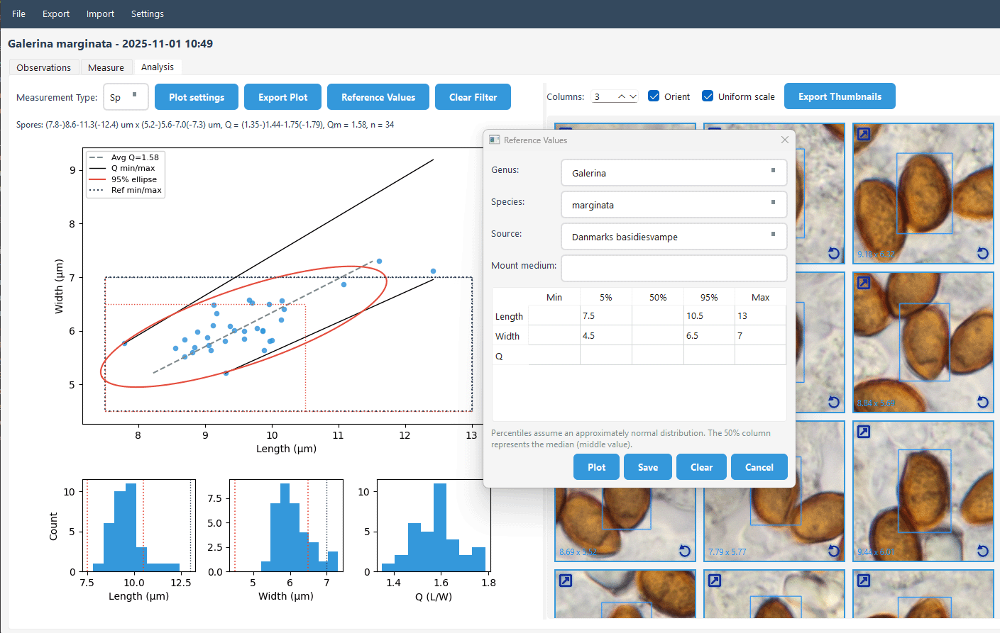

# 

A python app for measuring mushroom spores from microscope images, and organizing images and field photos.

## Features

- **Organize field observations:** Store your field photos, macro photos and microscope images in one place.
- **Measure spores from microscope images**: Easy spore and cell measurements. All measures are possible to review and edit later.
- **Calibration System**: Set image scale for your objectives 
- **Spore measurements**: or measures of basidia and cystidia, with histograms and estimated confidence intervals
- **Reference Values**: Store and compare literature reference values
- **Languages**:
  - User interface languages: Norwegian, English, German
  - Mushroom names in 11 languages: English, German, French, Spanish, Danish, Swedish, Norwegian, Finnish, Polish, Portuguese, Italian

## Installation

### Latest release

[Download the latest build](https://github.com/sigmundas/mycolog/releases/latest)

#### Install / run (Windows)
1. Download the `.zip` from the release page.
2. Extract it.
3. Run the `.exe` inside the extracted folder.


### Python installation

```bash
pip install -r requirements.txt
```

This installs:
- PySide6 (Qt GUI framework)
- numpy (calculations)
- Pillow (image processing)
- matplotlib (plots)
- requests (map/inaturalist lookups)
- pyproj (coordinate conversions)

#### Run the Application

```bash
python main.py
```

## Quick Start Guide

First step is to create a new observation by importing photos. Select a field photo taken with a phone if you want GPS coordinates.


Start by clicking measure mode. Hold shift to pan, mouse-wheel etc to zoom.



Select the type of measures you have taken. Click any graph element to filter thumbnails.



### First Time Setup

1. **Set Your Objective**
   - Go to menu: `Calibration > Microscope Objectives` (or press `Ctrl+K`)
   - Create a new objective or select from defaults (10X, 40X, 63X)
   - Enter your microscope's microns per pixel value
   - Click "Use This Objective"

2. **Set Your Profile**
   - Go to menu: `Settings > Profile`
   - Enter your name and email
   - This is not required, but handy if you share your database or import a database from others.

3. **Set Database Preferences**
   - Go to menu: `Settings > Database`
   - Choose the database folder and image folder
   - You set tags that show how measurements were made. Contrast method, type of mouting fluid, and type of sample analyzed. You can also set categories for what you're measuring - cells, spores etc.
   - You can set default values that are used when importing new images: put an asterisk (*) behind the default tag.

### Measuring Spores

1. **Register a new observation**
   - Click New Observation
   - Click Add Images. You can select multiple files. Support for png, jpg, tif, orf, nef, heic, heif
   - Tick for Field (macro photos from the field), or Micro (microscope images)
   - For microscope images, you can set objective, contrast, mount and sample type
   - The date&time and GPS coordinates are taken from the image you select in the table.
   - If you are sure, or pretty sure what the species is, fill out Genus and Species. If you don't know, select the "Unknown" tab, and fill out a working title.
   - Click Create Observation

2. **Navigate the Image**
   - **Zoom**: Use mouse wheel or View menu (Ctrl++ / Ctrl+-)
   - **Pan**: Hold Shift and drag the image
   - **Reset**: Click "Reset View" or press Ctrl+0

3. **Measure Spores**
   - Click Next/Previouis to select image
   - Make sure the Scale is correct, and select your Measure Category
   - Click Measure Mode
   - Click 4 points on a spore
   - Click any order - app auto-detects length (longer) and width (shorter)
   - Check the preview and adjust if you need to. If you adjust here, click "Apply Changes".

4. **View Measurement Preview**
   - Click any row in the Measurements table
   - See a magnified view of that measurement in the preview panel
   - Drag rectangle lines to adjust
   - Use rotation arrows to rotate the measurement
   - Click "Apply Changes" to save adjustments

5. **Abort or Delete Measurements**
   - If you make a mistake while measuring, click the "Measure mode" button
   - To delete a completed measurement, click the red "Delete" button

6. **Analysis**
   - Use the graph to explore length/width/Q distributions
   - You can click individual dots in the graph to see the measurement thumbnail on the right
   - You can clik columns in the histogram to filter a range of measures
   - Click a thumbnail link icon to jump to the measurement in the Measure tab
   - The 95% ellipse is the covariance ellipse from the length/width data: compute the mean and 2x2 covariance, take the eigenvectors as axes, and scale axis lengths by sqrt(chi-square(df=2, 0.95)) so the ellipse contains about 95% of points under a bivariate normal model.

7. **Reference Values**
   - Use the "Reference Values" button to view and store literature values
   - Plot values for comparison without saving, or save to the reference database

## Data Location

MycoLog stores user data in the OS-specific user data folder:

- Windows: `%APPDATA%\\MycoLog`
- macOS: `~/Library/Application Support/MycoLog`
- Linux: `~/.local/share/MycoLog`

Contents (created on demand):

- `images/` - Image store
- `imports/` - Imported files
- `thumbnails/` - Generated thumbnails
- `objectives.json` - Saved microscope objectives
- `last_objective.json` - Last used objective (auto-created)
- `mushrooms.db` - Main database
- `reference_values.db` - Reference values database

## Project Structure

```
MycoLog/
  main.py                      # Entry point
  config.py                    # Configuration settings
  requirements.txt             # Dependencies
  database/
    __init__.py
    schema.py                  # Database tables
    models.py                  # Data access (ObservationDB, ImageDB, MeasurementDB, ReferenceDB)
  ui/
    __init__.py
    main_window.py             # Main application window
    measurement_tool.py        # Measurement interaction logic
    observation_list.py        # Observation list widget
    observations_tab.py        # Observations tab
    zoomable_image_widget.py   # Zoomable/pannable image display
    spore_preview_widget.py    # Magnified rotated spore preview
    stats_table_widget.py      # Statistics table
    calibration_dialog.py      # Objective management dialog
    styles.py                  # Modern UI stylesheet
  utils/
    __init__.py
    annotation_capture.py      # Annotation helpers
    db_share.py                # Database export/import helpers
    exif_reader.py             # EXIF helpers
    heic_converter.py          # HEIC conversion
    image_utils.py             # Image processing helpers
    ml_export.py               # ML export
    stats.py                   # Statistical calculations
    thumbnail_generator.py     # Thumbnail generation
  build.ps1                    # Windows build script (PyInstaller)
  build_mac.sh                 # macOS build script (PyInstaller)
  build_linux.sh               # Linux build script (PyInstaller)
```

## Keyboard Shortcuts

- `Ctrl+O` - Open image
- `Ctrl+K` - Calibration dialog
- `Ctrl++` - Zoom in
- `Ctrl+-` - Zoom out
- `Ctrl+0` - Reset view
- `Ctrl+Q` - Quit application
- `Shift+Drag` - Pan image (hold Shift while dragging)

## Database Schema

### Observations Database

Stored in the **Database folder** chosen in `Settings > Database`. The main database file is named `mushrooms.db`.

- Observations table
- Images table
- Spore measurements table
- Thumbnails table
- Spore annotations table
- Settings table

### Reference Values Database

Stored in the same Database folder as `reference_values.db`.

- Reference values table (genus, species, source, mount medium, length/width/Q min/5%/50%/95%/max)

## Troubleshooting

### "No module named PySide6"
Run: `pip install -r requirements.txt`

### "No module named 'database'"
Make sure you're running from the MycoLog directory: `cd MycoLog && python main.py`

### "sqlite3.OperationalError: no such column: image_id"
Your database has an old schema. Run the migration:
```bash
python database/migrate.py
```

Or reset the database (WARNING: deletes all data):
```bash
python reset_database.py
```

### Calibration not saving
Check that your OS user data folder (see Data Location above) has write permissions

## Building from source

### Windows

```powershell
./build.ps1
```

### macOS

```bash
chmod +x build_mac.sh
./build_mac.sh
```

### Linux

```bash
chmod +x build_linux.sh
./build_linux.sh
```

## License

MIT License - Feel free to modify and extend!
