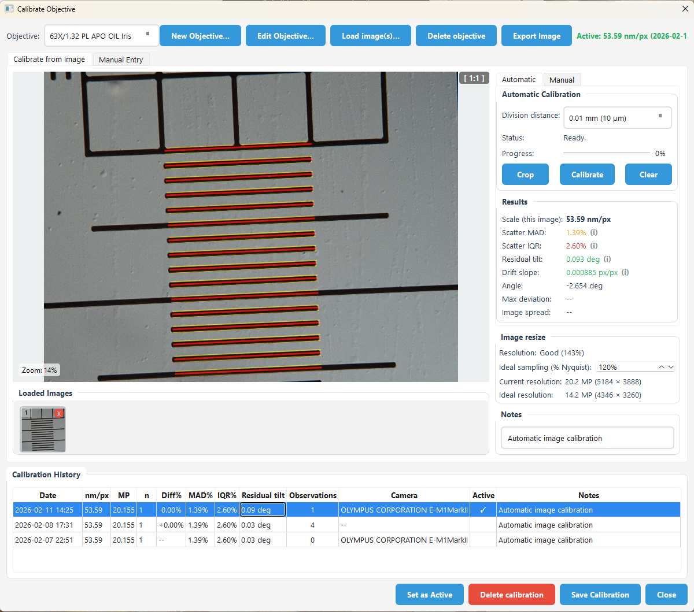
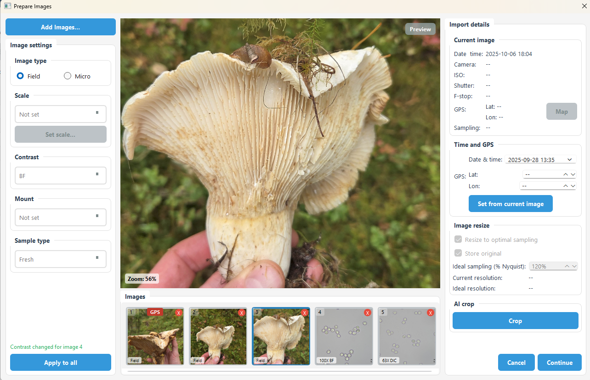
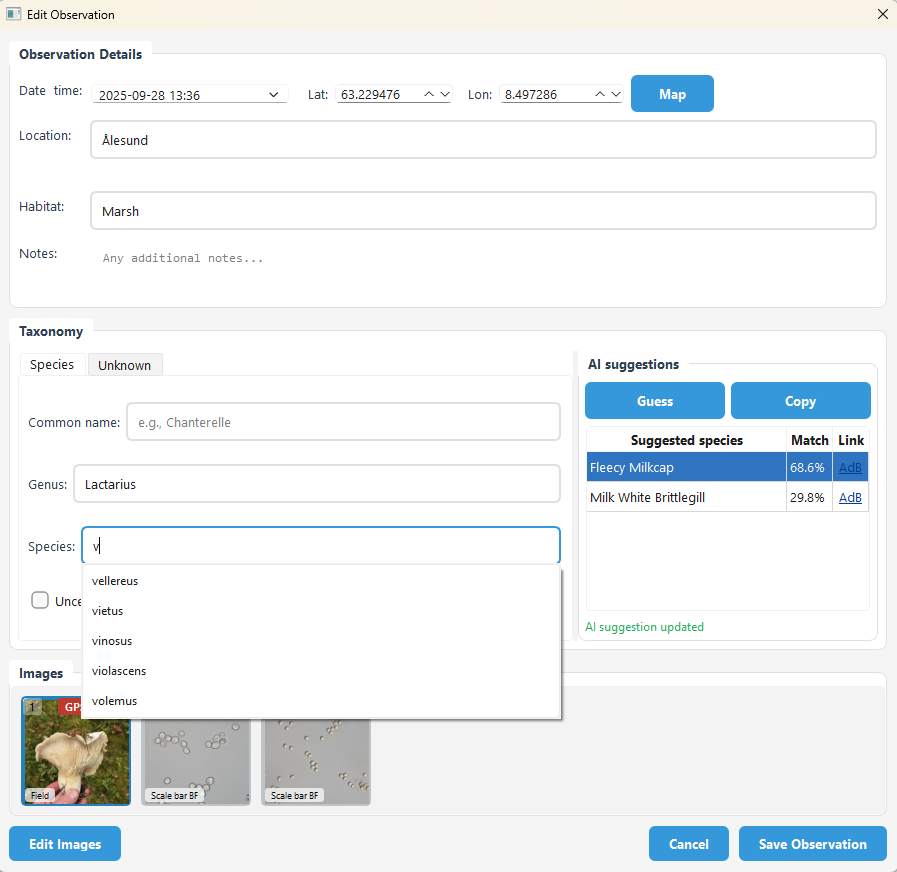
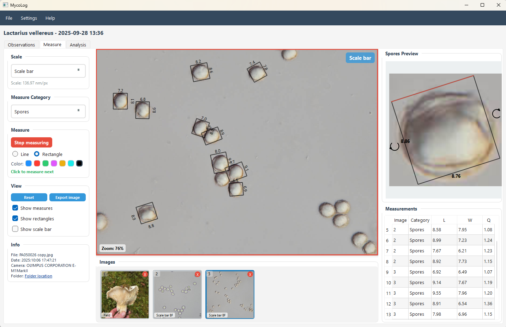
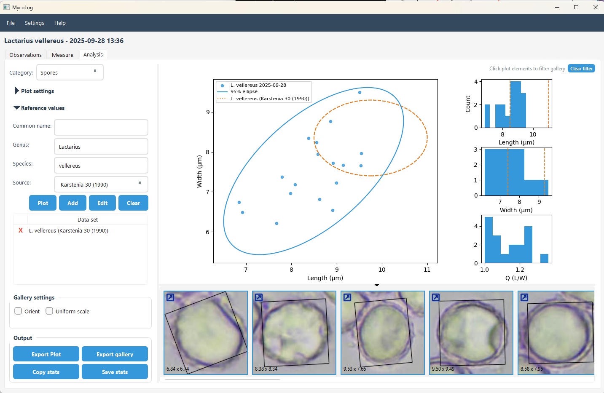

# 

MycoLog is a desktop app for field observations, microscopy calibration, and spore measurements.

## Installation

Download the latest build from:
https://github.com/sigmundas/mycolog/releases/latest

#### Install / run
1. Download and extract the archive
2. Run the executable

### Python installation

```bash
pip install -r requirements.txt
python main.py
```


## First Run

1. Open `Calibration > Microscope Objectives`.
2. Add or edit objectives (Magnification, NA, Objective name).
3. Calibrate an objective (auto or manual) and set it active.
4. Confirm your database folder in `Settings > Database`.

## Create Your First Observation

1. Click **New Observation**.
2. Add images (field or microscope). Multi-select is supported.
3. For microscope images, choose Objective/Scale, Contrast, Mount, and Sample type.
4. Use **Apply to all** to copy settings to selected images.
5. Save the observation.

## Measure and Analyze

- Use the **Measure** tab to draw rectangles for spores or line measurements for length-only.
- Use **Analysis** to plot distributions and compare with reference datasets.

## Screenshots

Automatic or manual calibration of image scales: 


Create a new observation by importing images: 


Search-as-you-type species, or use AI lookup to guess the species: 


Measure spores or other features: 


Review plots and compare to references: 


## Documentation
- [Field photography](docs/field-photography.md)
- [Microscopy workflow](docs/microscopy-workflow.md)
- [Spore measurements](docs/spore-measurements.md)
- [Taxonomy integration](docs/taxonomy-integration.md)
- [Database structure](docs/database-structure.md)
- [Changelog](CHANGELOG.md)


## License

MIT License - feel free to modify and extend.
