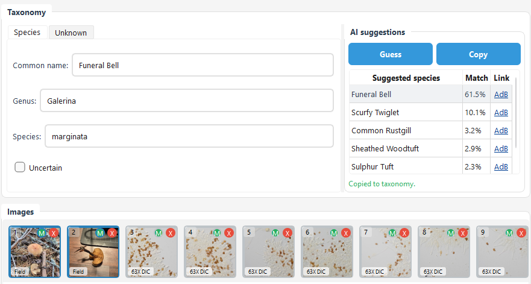

# Field Photography

## Purpose

Field photos are for documenting context, habitat, and macroscopic features. They can also be used for length/size annotations when a scale is available: either as a ruler in the focus plane, or if you shoot with a macro lens with a known magnification.

Field photos are also used for AI species recognition, using [Artsorakelet](https://orakel.artsdatabanken.no/).

## Importing Field Photos

1. In **Prepare Images**, select images.
2. Set **Image type** to **Field**.
3. If the image has EXIF date/GPS, use **Set from current image** to populate observation metadata.
4. To get more precise AI identification, use the crop tool to select a tight crop of the mushroom.

## Field photos for AI identification

1. Select one or multiple (ctrl + click) field photos in the **Edit Observation** dialog
2.  Press **Guess** and the table will populate
3. Press **Copy** to copy the species over to the species name fields for this observation.

## Measuring Lengths in Field Images

- Select **Category: Field** in the Measure tab.
- Use the **Line** tool (two clicks) to annotate length.
- If no scale is set, measurements are relative; set a scale if you need real units.

## Tips

- Use a consistent camera or include a scale reference when possible.
- Capture multiple angles of the mushroom and include the habitat.

## See also

- [Microscopy workflow](docs/microscopy-workflow.md)
- [Spore measurements](docs/spore-measurements.md)
- [Taxonomy integration](docs/taxonomy-integration.md)
- [Database structure](docs/database-structure.md)
