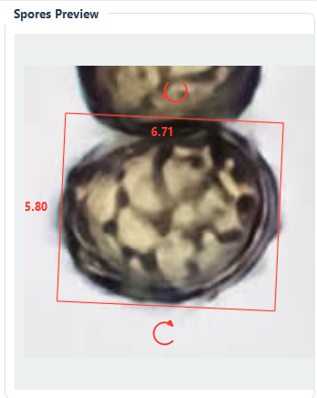

# Spore Measurements

## Measurement Modes

- **Rectangle**: four clicks to define length and width for spores.
- **Line**: two clicks to measure length only.

## Categories

Common categories include **Spores** and **Field**. Categories determine how measurements are grouped and plotted.

## Reviewing Measurements

- Select a row in the measurements table to preview.
- Adjust lines and apply changes in the preview pane.
- Delete unwanted measurements from the table.

Drag the lines you want to adjust - the spore dimensions are updated instantly

## Analysis

- Scatter plot shows length vs width.
- Histograms (optional) show distributions.
- Confidence ellipse can be shown for datasets with point measurements.

### 95% Confidence Ellipse

For bivariate measurements (length $x$ and width $y$), the 95% confidence ellipse
is defined from the sample mean and covariance matrix. Let
$\mathbf{z} = \begin{bmatrix} x \\ y \end{bmatrix}$, the mean
$\boldsymbol{\mu} = \begin{bmatrix} \bar{x} \\ \bar{y} \end{bmatrix}$, and the
covariance matrix

$$
\mathbf{\Sigma} =
\begin{bmatrix}
s_{x}^{2} & s_{xy} \\
s_{xy} & s_{y}^{2}
\end{bmatrix}
$$

Then the ellipse is the set of points satisfying

$$
(\mathbf{z} - \boldsymbol{\mu})^{\mathsf{T}} \mathbf{\Sigma}^{-1}
(\mathbf{z} - \boldsymbol{\mu}) = \chi^{2}_{2,\,0.95}
$$

where $\chi^{2}_{2,\,0.95} \approx 5.991$ is the 95th percentile of the
chi-square distribution with 2 degrees of freedom.

Equivalently, if $\lambda_{1}, \lambda_{2}$ are the eigenvalues of
$\mathbf{\Sigma}$ and $\mathbf{v}_{1}, \mathbf{v}_{2}$ the corresponding
eigenvectors, the ellipse axes are

$$
a = \sqrt{\chi^{2}_{2,\,0.95} \, \lambda_{1}}, \qquad
b = \sqrt{\chi^{2}_{2,\,0.95} \, \lambda_{2}}
$$

with the ellipse rotated by the eigenvectors $\mathbf{v}_{1}, \mathbf{v}_{2}$.

## Reference Data

- Add multiple reference datasets and toggle them in the plot table.
- Legend labels include genus initial and source, e.g. `G. marginata (Pedersen)`.
- Use **Add** and **Edit** to manage reference datasets.

## Export

### Observation Export

- **Export plot**: saves the current analysis plot (scatter + optional histograms).
- **Export gallery**: creates an annotated thumbnail mosaic for the active observation.
- **Copy stats / Save stats**: exports summary statistics plus a tab-separated table of raw measurements.

These actions live in the **Output** section of the Analysis tab and use the currently selected observation and category.

## See also

- [Field photography](docs/field-photography.md)
- [Microscopy workflow](docs/microscopy-workflow.md)
- [Taxonomy integration](docs/taxonomy-integration.md)
- [Database structure](docs/database-structure.md)
